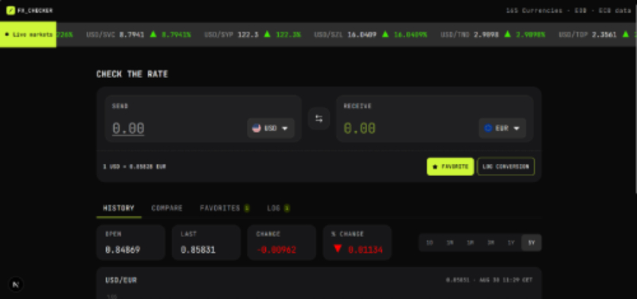
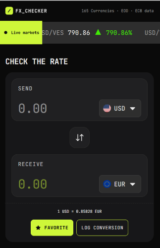

# Frontend Mentor - FX Checker solution

This is a solution to the [FX Checker challenge on Frontend Mentor](https://www.frontendmentor.io/challenges/foreign-exchange-currency-converter). Frontend Mentor challenges help you improve your coding skills by building realistic projects. 

## Table of contents

- [Overview](#overview)
  - [The challenge](#the-challenge)
  - [Screenshot](#screenshot)
  - [Links](#links)
- [My process](#my-process)
  - [Built with](#built-with)
  - [Continued development](#continued-development)
  - [Useful resources](#useful-resources)
  - [AI Collaboration](#ai-collaboration)
- [Author](#author)

## Overview

### The challenge

Your users should be able to:

#### Converter

- Enter an amount to send and see it convert in real time as they type
- Pick the "send" and "receive" currencies from a searchable currency picker
- See the live exchange rate for the active pair (for example, `1 USD = 0.8530 EUR`)
- Swap the send and receive currencies with the swap button
- Favorite the active pair, and log a conversion to their history

#### Currency picker

- Search the full list of available currencies by code or name
- See currencies grouped into "Popular" and "Other currencies", each row showing the flag, code, and name
- See a check against the currency that's currently selected

#### Live markets ticker

- See a ticker of currency pairs, each with its current rate and 24-hour change (up or down)

#### Rate history

- View a line and area chart of the active pair's rate over time
- Switch the chart range between 1D, 1W, 1M, 3M, 1Y, and 5Y
- See the open, last, absolute change, and percentage change for the selected range

#### Compare

- See their send amount converted into a range of other currencies at once, each with its reference rate
- Pin or unpin any comparison row to their favorites

#### Favorites

- See their pinned pairs, each with its live rate and 24-hour change
- Load a pinned pair back into the converter by selecting its row
- Unpin a pair they no longer want to track

#### Conversion log

- See a log of conversions they've made, each showing the relative time, the pair, and the send and receive amounts
- Clear the whole log
- Delete an individual entry

#### UI & accessibility

- View the optimal layout for the interface depending on their device's screen size
- See hover and focus states for all interactive elements on the page
- Navigate the entire app using only their keyboard

### Screenshot
| Desktop                     | Mobile                     |
|-----------------------------|----------------------------|
|  |  |

### Links

- Solution URL: [https://github.com/victoire20/foreign-exchange-checker](https://github.com/victoire20/foreign-exchange-checker)
- Live Site URL: [https://foreign-exchange-checker-murex.vercel.app](https://foreign-exchange-checker-murex.vercel.app)

## My process

### Built with

- Semantic HTML5 markup
- CSS custom properties
- Tailwind CSS
- Flexbox
- Mobile-first workflow
- [Next.js](https://nextjs.org/) - React framework
- [Styled Components](https://styled-components.com/) - For styles

### Continued development

I want to implement:
- white theme
- dashboard user for manage his data

### Useful resources

- [Sonner - Shadcn UI](https://ui.shadcn.com/docs/components/radix/sonner) - I used that for the customizable toast alert

### AI Collaboration

Describe how you used AI tools (if any) during this project. This helps demonstrate your ability to work effectively with AI assistants.

- I use free version of Codex and Copilote
- I use that for scanne my project to detect some erreur what i don't see! Je dois avouer que cela m'a vraiment aider quand j'ai ajouter flex-rows dans une class et que j'ai passé au moins 30min à chercher sans savoir où est ce que je m'étais trompé 😅
- Honnêtement, je trouve que la seule différence est la manière dont est utilisés les tokens ! C'est avis, mais j'ai remarqué que c'est bien mieux optimisé dans copilote que dans codex! Sauf que je mets parfois un de temps a insisté pour dire non, je veux que tu choisisses cette approche plutôt que l'autre à copilote qu'à codex 😅

## Author

- Website - [https://portfolio-eight-dun-30.vercel.app](https://portfolio-eight-dun-30.vercel.app)
- Frontend Mentor - [@victoire20](https://www.frontendmentor.io/profile/victoire20)

